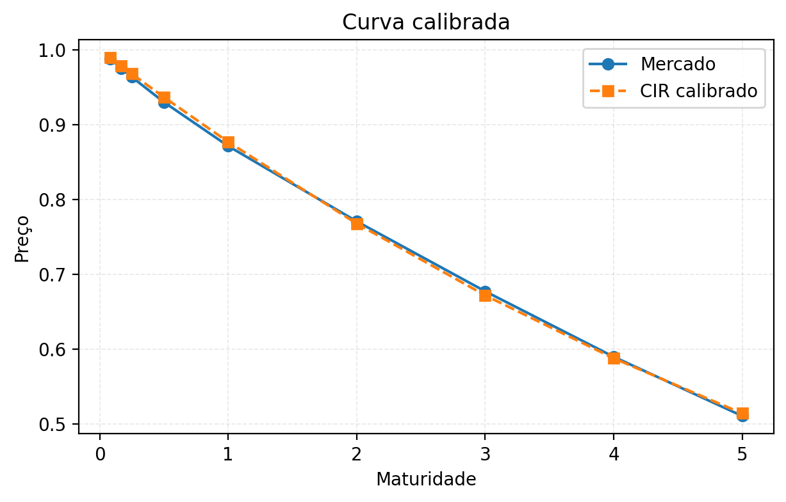
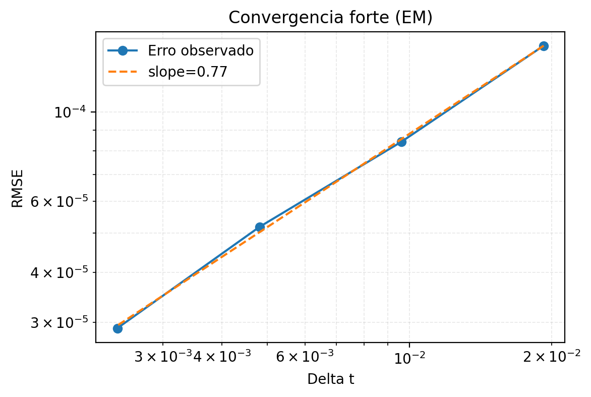
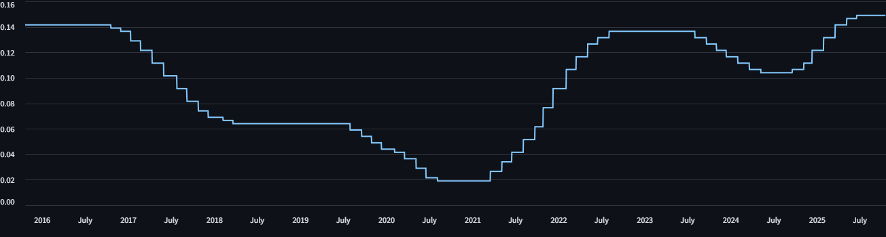

# 📉 Stochastic Short Rate Lab (CIR, Vasicek & Hull-White)

<div align="center">


</div>

> **Framework completo para simulação, precificação e calibração de modelos de taxa curta (short rate), com dashboard interativo e análise de convergência forte.**

> Short rate = taxa de juros instantânea aplicável em um intervalo de tempo infinitesimal. É como se fosse a “taxa de juros agora”, no limite 𝑑𝑡→0.

Este repositório contém uma implementação robusta do processo **Cox-Ingersoll-Ross (CIR)** e benchmarks comparativos (Vasicek, Hull-White). O projeto abrange desde a resolução numérica de Equações Diferenciais Estocásticas (SDEs) até a calibração com dados reais da **Curva DI (Depósito Interbancário) brasileira**.

---

## 🎯 Destaques do Projeto

* **Pipeline Completo:** Simulação (Euler-Maruyama e Milstein), Precificação de Zeros e Bonds, e Calibração.
* **Rigor Matemático:** Validação da **Condição de Feller** ($2\kappa\theta > \sigma^2$) e estimativa de ordem de convergência forte.
* **Dados Reais:** Utilização de dados brasileiros reais da curva DI e taxa Selic.
* **Interatividade:** Dashboard **Streamlit** para análise de sensibilidade e cenários de ALM (Asset Liability Management).

---

## 📊 Galeria Visual

### 1. Dashboard Interativo (Streamlit)
*Visualização em tempo real das trajetórias, yield curves e calibração.*

#### 1.1 Trajetórias simuladas da taxa curta: cada linha colorida é uma realização Monte Carlo do processo de taxa curta `r_t` do modelo selecionado (CIR/Vasicek/Hull‑White), já calibrado à curva DI/SELIC carregada.

<div align="center">
  
</div>

> As curvas mostram cenários possíveis para a evolução da taxa: todas partem do `r0` calibrado, sofrem choques aleatórios e tendem a reverter para o nível de longo prazo θ, por isso ficam “embaraçadas” na mesma faixa.

#### 1.2 Curva zero-coupon: mostra a curva zero-coupon gerada pelas simulações Monte Carlo (sintético).

<div align="center">
  
</div>

> Zero-coupon = título de investimento que não paga juros periódicos (cupons), mas é vendido com um desconto em relação ao seu valor de face (valor que o investidor recebe no vencimento). Exemplo: "compro" um cupom de R$1000,00 hoje pagando apenas R$800,00 (desconto de 20%), e no futuro (final do prazo), resgato os R$1000,00 cheio.

> A linha azul mostra o preço do título hoje: quanto maior o prazo, menor o preço (maior o desconto).

> A linha vermelha mostra a taxa de juros implícita desses preços (yield). As ondulações vêm do sorteio aleatório das simulações.

#### 1.3 Curva zero-coupon calibrada aos dados reais (curva DI).

<div align="center">
  
</div>

> Linha azul (“Mercado”) são os preços observados/derivados da curva DI real.

> Linha laranja (“CIR calibrado”) são os preços que o modelo CIR produz depois de ajustar seus parâmetros para imitar a curva real.

### 2. Análise de Convergência
*Comparativo de erro forte (RMSE) da discretização de Euler Maruyama.*
<div align="center">
  
</div>

> Pontos azuis: o erro observado para cada tamanho de passo.

> Linha laranja tracejada (slope=0.77): a inclinação ajustada numa escala log-log; mostra como o erro cresce quando você aumenta o passo.

### 3. Exposição dos Dados Econômicos
*Demonstração gráfica dos dados da taxa selic e da curva pré-fixada, ao longo do tempo.*
> Curva da taxa selic ao longo do tempo.
<div align="center">
  
</div>

> Curva de pré-fixada.
<div align="center">
  
</div>

---

## 📐 Fundamentação Teórica

O modelo CIR segue a seguinte dinâmica estocástica:

$$dr_t = \kappa(\theta - r_t)dt + \sigma \sqrt{r_t} dW_t$$

Onde a implementação garante a **positividade** da taxa e estabilidade numérica através do esquema de Milstein modificado para processos de raiz quadrada.

---

## 🚀 Instalação Rápida

```bash
# 1. Clone o repositório
git clone https://github.com/cockles98/cir-short-rate-lab.git
cd cir-short-rate-lab

# 2. Crie o ambiente virtual
python -m venv .venv
source .venv/bin/activate  # Linux/Mac
# .venv\Scripts\activate   # Windows

# 3. Instale as dependências
pip install -r requirements.txt
```

-----

## 🖥️ Dashboard & CLI

### Modo Interativo (Streamlit)

A maneira mais fácil de explorar o modelo.

```bash
streamlit run streamlit_app/app.py
```

> **Ou acessando diretamente o dashboard online através do [link](https://cockles98-stochastic-short-rate-lab-streamlit-appapp-slmkui.streamlit.app).**

*Funcionalidades:* Calibração em tempo real, Comparativo Visual (CIR vs Vasicek), Cenários de Stress (ALM).

### Modo CLI (Linha de Comando)

Para execuções em lote e geração de relatórios, utilize o módulo `cir.cli`.

| Comando | Descrição | Exemplo |
| :--- | :--- | :--- |
| `simulate-paths` | Gera trajetórias estocásticas | `python -m cir.cli simulate-paths --preset baseline` |
| `convergence` | Análise de erro forte (Log-Log) | `python -m cir.cli convergence --scheme milstein` |
| `term-structure` | Gera curva Zero-Coupon via MC | `python -m cir.cli term-structure --Tmax 10` |
| `calibrate-market` | Ajusta parâmetros à curva DI | `python -m cir.cli calibrate-market --data data/raw_di_curve.csv` |

-----

## 📂 Estrutura do Repositório

  * **`cir/`**: Núcleo da biblioteca (SDEs, Solvers, Calibração).
  * **`benchmarks/`**: Implementações comparativas (Vasicek, Hull-White).
  * **`streamlit_app/`**: Código do frontend interativo.
  * **`scripts/`**: Utilitários para download de dados (Data Fetchers).
  * **`tests/`**: Suite de testes automatizados (`pytest`) para validação matemática.
  * **`notebooks/`**: Estudos de caso e validações exploratórias.

-----

## 📜 Créditos e Contexto

Projeto desenvolvido para a disciplina de **Modelagem Matemática em Finanças II (UFRJ, 2025/2)**.

  * **Objetivo:** Implementação numérica rigorosa de modelos de taxa curta para precificação de derivativos e gestão de portfólio.
