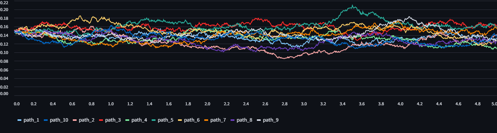
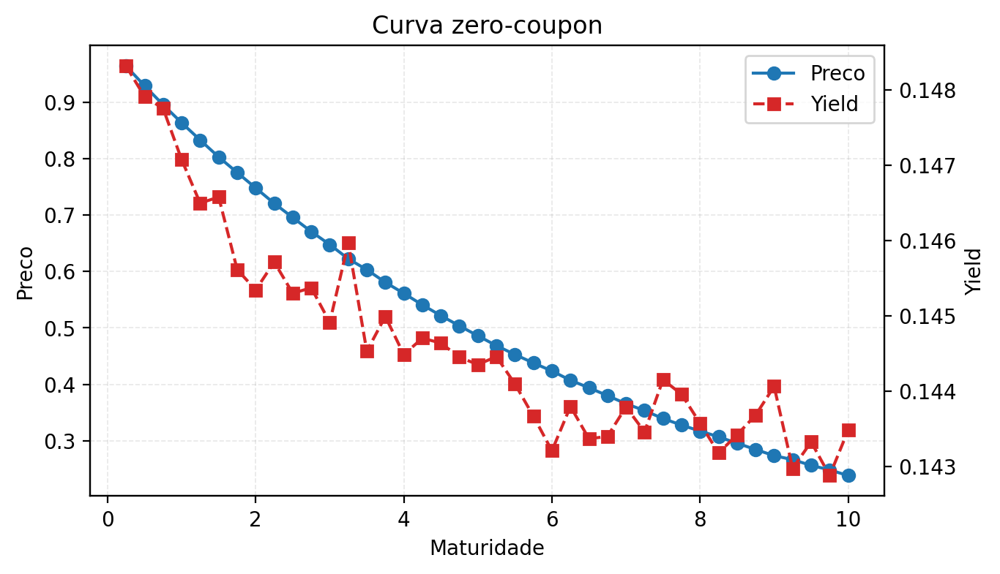
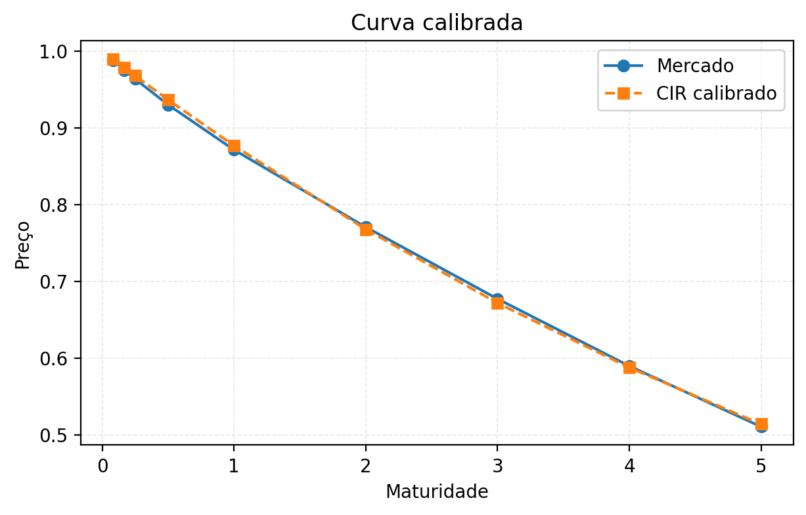
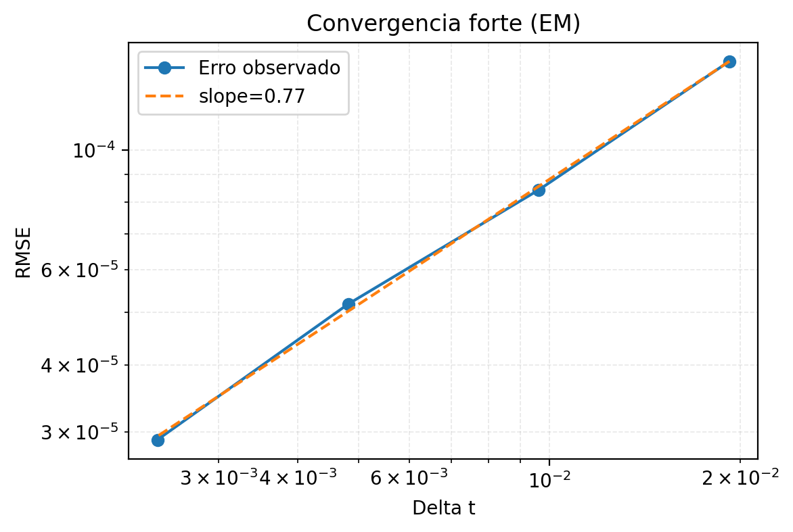
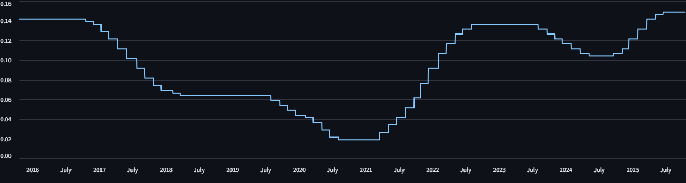
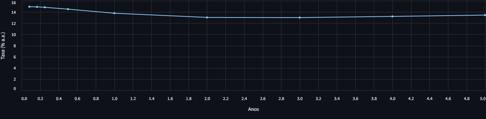

# 📉 Stochastic Short Rate Lab (CIR, Vasicek & Hull-White)

<div align="center">


</div>

> **A complete framework for simulation, pricing, and calibration of short-rate models — with an interactive dashboard and strong convergence analysis.**

This repository implements the **Cox-Ingersoll-Ross (CIR)** model with comparative benchmarks (Vasicek, Hull-White), covering everything from numerical SDE solving to real-world calibration against **Brazilian DI curve** data. Built with both rigor and usability in mind: the full pipeline is accessible via CLI, Python API, or an interactive Streamlit dashboard.

**[🚀 Try the live dashboard here](https://cockles98-stochastic-short-rate-lab-streamlit-appapp-slmkui.streamlit.app)**

---

## 🎯 Project Highlights

- **Full Pipeline:** Simulation (Euler-Maruyama and Milstein), zero-coupon bond pricing, term structure generation, and model calibration
- **Mathematical Rigor:** Feller condition validation ($2\kappa\theta > \sigma^2$), strong convergence order estimation, and mass conservation tests
- **Real Market Data:** Calibration against real Brazilian DI curve and Selic rate data
- **Interactive Dashboard:** Streamlit app for sensitivity analysis, model comparison, and ALM stress scenarios

---

## 📊 Visual Gallery

### 1. Interactive Dashboard (Streamlit)

#### Simulated Short Rate Trajectories
Each colored line is a Monte Carlo realization of the short rate process $r_t$ under the selected model (CIR/Vasicek/Hull-White), calibrated to the loaded DI/Selic curve. All paths start from the calibrated $r_0$ and mean-revert toward the long-run level $\theta$.

<div align="center">
  
</div>

#### Synthetic Zero-Coupon Curve
Zero-coupon curve generated from the Monte Carlo simulations. The blue line shows today's bond prices across maturities; the red line shows the implied yield curve. Oscillations reflect sampling noise from the stochastic simulations.

<div align="center">
  
</div>

#### Calibrated Zero-Coupon Curve (vs. Real DI Data)
The blue line ("Market") represents prices derived from the real DI curve. The orange line ("Calibrated CIR") shows prices produced by the CIR model after fitting its parameters to replicate the market curve.

<div align="center">
  
</div>

### 2. Convergence Analysis

#### Strong Error (RMSE) — Euler-Maruyama Discretization
Blue dots show observed error per step size. The dashed orange line (slope = 0.77 in log-log scale) shows the fitted convergence rate — consistent with the theoretical strong order of 0.5 for the CIR process under Euler-Maruyama.

<div align="center">
  
</div>

### 3. Brazilian Market Data

#### Selic Rate Over Time
Each step marks the base rate set by the COPOM committee — constant between decisions, producing the characteristic step-function shape.

<div align="center">
  
</div>

#### Prefixed DI Zero-Coupon Curve
Each point is the rate of a prefixed zero-coupon instrument maturing at that tenor — raw market data used as calibration input for CIR/Vasicek/Hull-White.

<div align="center">
  
</div>

---

## 📐 Mathematical Foundation

The CIR model follows the stochastic dynamics:

$$dr_t = \kappa(\theta - r_t)dt + \sigma \sqrt{r_t} dW_t$$

The implementation enforces **rate positivity** and numerical stability through a modified Milstein scheme for square-root processes, with Feller condition validation at calibration time.

---

## 🚀 Getting Started

```bash
# 1. Clone the repository
git clone https://github.com/cockles98/cir-short-rate-lab.git
cd cir-short-rate-lab

# 2. Create virtual environment
python -m venv .venv
source .venv/bin/activate  # Linux/Mac
# .venv\Scripts\activate   # Windows

# 3. Install dependencies
pip install -r requirements.txt
```

---

## 🖥️ Dashboard & CLI

### Interactive Mode (Streamlit)

```bash
streamlit run streamlit_app/app.py
```

> **Or access the [live dashboard](https://cockles98-stochastic-short-rate-lab-streamlit-appapp-slmkui.streamlit.app) directly — no installation required.**

Features: real-time calibration, visual model comparison (CIR vs. Vasicek vs. Hull-White), stress scenario analysis for ALM.

### CLI Mode

| Command | Description | Example |
| :--- | :--- | :--- |
| `simulate-paths` | Generate stochastic trajectories | `python -m cir.cli simulate-paths --preset baseline` |
| `convergence` | Strong error analysis (log-log) | `python -m cir.cli convergence --scheme milstein` |
| `term-structure` | Generate zero-coupon curve via MC | `python -m cir.cli term-structure --Tmax 10` |
| `calibrate-market` | Fit parameters to DI curve | `python -m cir.cli calibrate-market --data data/raw_di_curve.csv` |

---

## 📂 Repository Structure

- **`cir/`** — Core library (SDEs, solvers, calibration)
- **`benchmarks/`** — Comparative implementations (Vasicek, Hull-White)
- **`streamlit_app/`** — Interactive frontend
- **`scripts/`** — Data fetching utilities
- **`tests/`** — Automated test suite (`pytest`) for mathematical validation
- **`notebooks/`** — Case studies and exploratory validation

---

*Interested in similar work — interest rate modeling, derivatives pricing, or stochastic simulation? Feel free to reach out via [LinkedIn](https://www.linkedin.com/in/felipe-cockles) or [email](mailto:felipe.cockles@hotmail.com).*
