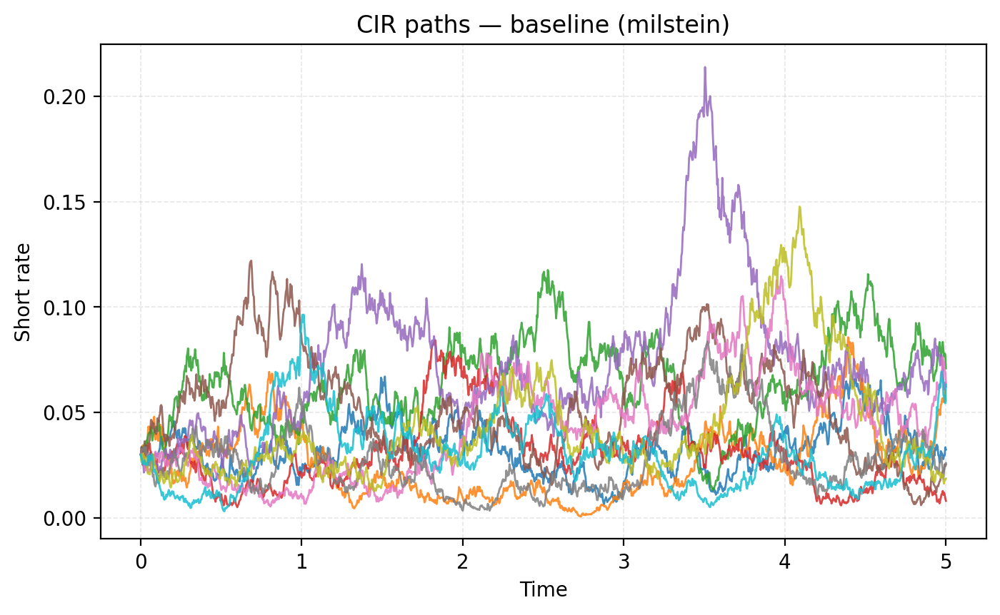
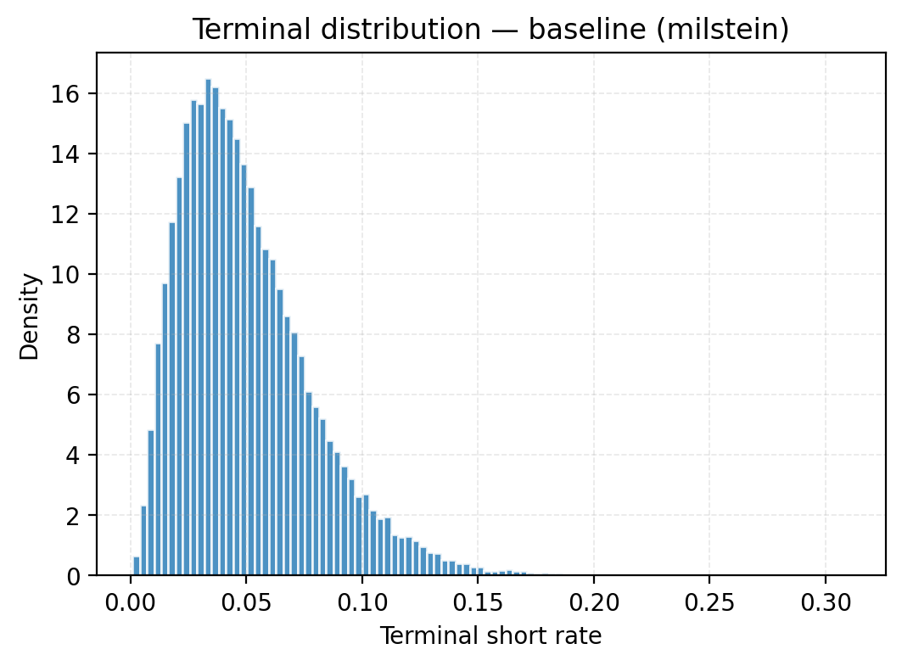
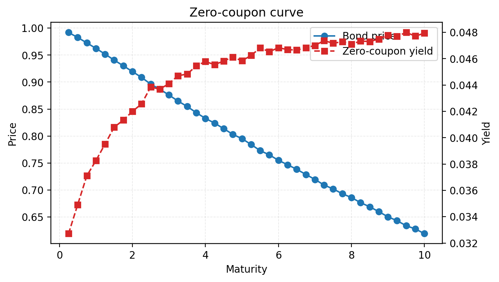

# Relatorio Base - Modelo CIR

## Introducao

O processo CIR modela a taxa de juros de curto prazo como uma SDE de media-reversao com difusao raiz-quadrada. A condicao de Feller `2*kappa*theta > sigma**2` garante positividade estrita ao impedir que o processo atinja zero; todos os presets usados no projeto respeitam tal restricao e sao validados em `cir.params`.

## Metodos numericos

Implementamos dois esquemas explcitos:

- **Euler-Maruyama (EM)**: simples e rapido, mas sujeito a vies proximo de zero. A cada passo usamos `sqrt(max(r_t, 0))` e aplicamos um clamp final `np.maximum` para evitar taxas negativas.
- **Milstein**: acrescenta o termo de derivada de difusao `0.25*sigma**2*(xi**2-1)*dt`, elevando a ordem forte para~1. As mesmas salvaguardas de positividade sao aplicadas.

Em ambos os casos `n_steps = T * steps_per_year` e os incrementos Brownianos sao gerados por `normal_increments` com PCG64 para reproducibilidade.

## Resultados

Os graficos abaixo mostram amostras de trajetorias simuladas com o esquema de Milstein para os tres presets:

A distribuicao terminal para o preset baseline em `T=5` (50k trajetorias) evidencia a concentracao em torno da media de longo prazo:

## Convergencia

O estudo forte com EM (`T=1`, 50k caminhos, malhas 52-832) produziu inclinacao estimada **0.665**, consistente com a ordem teorica ~0.5. O ajuste e salvo em `figures/convergence_em.png` e os dados na tabela `data/convergence_em.csv`.

## Bond e Estrutura a Termo

Os precos Monte Carlo foram obtidos com 5k trajetorias por maturidade usando chunking interno para economizar memoria:

| T (anos) | B(0,T) | Erro padrao |
| --- | --- | --- |
| 1 | 0.9622 | 1.94e-4 |
| 3 | 0.8752 | 5.59e-4 |
| 5 | 0.7923 | 7.42e-4 |

A curva completa (0.25 a 10 anos, 40 pontos) esta registrada em `data/term_structure_milstein_baseline.csv`; a figura a seguir combina precos e yields calculados como `-ln(B)/T`:

## Conclusoes e proximos passos

- Os esquemas EM/Milstein preservam a positividade e produzem convergencia alinhada com a teoria.
- As figuras confirmam reversao a media em todos os presets e a estabilidade da distribuicao terminal.
- A precificacao Monte Carlo gera curvas suaves e yields nao negativos para os parametros considerados.

Proximos passos incluem: comparar com a solucao fechada do CIR para validar erros absolutos, testar tamanhos de passo adaptativos, calibrar os parametros com dados reais e integrar os scripts de rodadas completas a pipelines CI/CD para reproducao automatica.
